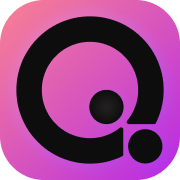
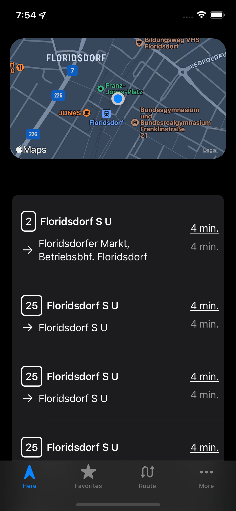

#  &nbsp;&nbsp;&nbsp; neoQando

 Vienna public transport utility iOS App
 
 Work in progress - Feel free to contribute
 
 

Taking inspiration from Stadtfahrt, WienMobil and Qando. Starting an open-source app to be developed as a community effort.

<ins>Project Goals:</ins>
- Open Source
- On-Device Routing (No API Calls)
- Apple Maps + Basemap Support
## License

[GPLv3 License](https://github.com/hadig/neoQando/blob/main/LICENSE)
